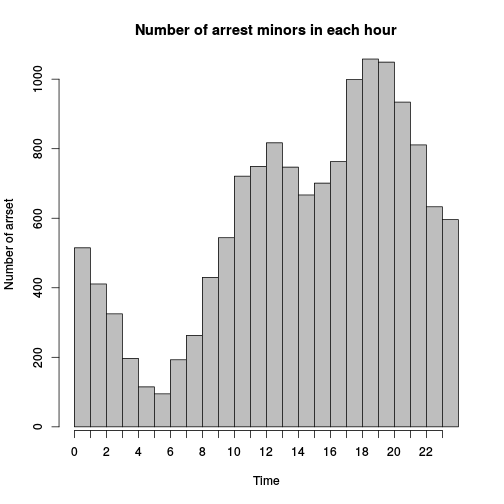
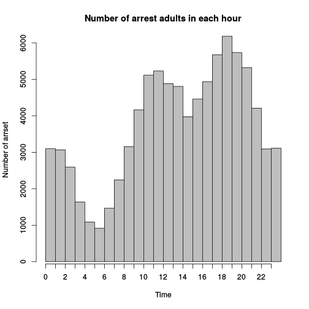

A quick analysis of Baltimore crime
========================================================

I'm going to do a very simple analysis of Baltimore crime to show off R. We'll use data downloaded from Baltimore City's awesome open data site. 

### Getting data

* Arrest data: https://data.baltimorecity.gov/Crime/BPD-Arrests/3i3v-ibrt 
* CCTV data: https://data.baltimorecity.gov/Crime/CCTV-Locations/hdyb-27ak 

Let's load the data:

```r
arrest_tab = read.csv("BPD_Arrests.csv", stringsAsFactors = FALSE)
cctv_tab = read.csv("CCTV_Locations.csv", stringsAsFactors = FALSE)

# these columns are mislabeled, so fix them
tmp = arrest_tab$sex
arrest_tab$sex = arrest_tab$race
arrest_tab$race = tmp
```


### Exploring data


```r
# dimension of table (data.frame)
dim(arrest_tab)
```

```
## [1] 104528     15
```

```r

# what are the columns
names(arrest_tab)
```

```
##  [1] "arrest"            "age"               "sex"              
##  [4] "race"              "arrestDate"        "arrestTime"       
##  [7] "arrestLocation"    "incidentOffense"   "incidentLocation" 
## [10] "charge"            "chargeDescription" "district"         
## [13] "post"              "neighborhood"      "Location.1"
```

```r

# what is the average arrest age?
mean(arrest_tab$age)
```

```
## [1] 33.2
```

```r

# the range of arrest ages
range(arrest_tab$age)
```

```
## [1]  0 87
```

```r

# how many arrests per sex
table(arrest_tab$sex)
```

```
## 
##           F     M 
##     2 19431 85095
```

```r

# what are the most common offenses
head(sort(table(arrest_tab$incidentOffense), decreasing = TRUE))
```

```
## 
##         Unknown Offense            87-Narcotics       4E-Common Assault 
##                   38649                   24744                    6739 
## 87O-Narcotics (Outside)     97-Search & Seizure                79-Other 
##                    6515                    3670                    3461
```

```r

# range of arrests after removing those w/ age==0
range(arrest_tab$age[arrest_tab$age > 0])
```

```
## [1]  8 87
```


Let's see a table of arrests by sex and race

```r
table(sex = arrest_tab$sex, race = arrest_tab$race)
```

```
##    race
## sex           A     B     H     I     U     W
##         2     0     0     0     0     0     0
##   F     0    37 14663     0    34   183  4514
##   M     0   205 72605     1   184  1566 10534
```


A histogram of age


```r
hist(arrest_tab$age, nc = 100)
```

 

```r
with(arrest_tab, hist(age[sex == "M"], nc = 100))  # males only
```

 

```r
with(arrest_tab, hist(age[sex == "F"], nc = 100))  # females only
```

 


### Are males and females arrested at different ages on average?

Let's take a look at how age depends on sex. Let's plot age as a function of sex first (notice how we indicate that sex is a `factor`). 


```r
plot(arrest_tab$age ~ factor(arrest_tab$sex))
```

 


One of the neat things about R is that statistical model building and testing is built-in. The model we use is $y_i=\beta_0+\beta_1 x_i$ where $y_i$ is age of sample (example) $i$ and $x_i$ is an indicator variable $x_i \in \{0,1\}$ with $x_i=1$ if the $i$-th record (example) is male. You can check that $\beta_1$ is the difference in mean age between females and males.
We use the formula syntax to build a linear regression model. 


```r
# let's ignore those records with missing sex
fit = lm(age ~ factor(sex), data = arrest_tab, subset = arrest_tab$sex %in% 
    c("M", "F"))
summary(fit)
```

```
## 
## Call:
## lm(formula = age ~ factor(sex), data = arrest_tab, subset = arrest_tab$sex %in% 
##     c("M", "F"))
## 
## Residuals:
##    Min     1Q Median     3Q    Max 
## -33.39 -10.15  -3.15   9.61  53.85 
## 
## Coefficients:
##              Estimate Std. Error t value Pr(>|t|)    
## (Intercept)   33.3878     0.0847   394.1   <2e-16 ***
## factor(sex)M  -0.2343     0.0939    -2.5    0.013 *  
## ---
## Signif. codes:  0 '***' 0.001 '**' 0.01 '*' 0.05 '.' 0.1 ' ' 1
## 
## Residual standard error: 11.8 on 104524 degrees of freedom
## Multiple R-squared:  5.96e-05,	Adjusted R-squared:  5e-05 
## F-statistic: 6.23 on 1 and 104524 DF,  p-value: 0.0126
```


We see that $\beta_1 \approx -0.2$ meaning that the arrest age for males is about 2.5 months younger. So there is very little difference in the average age (which is what the linear model is testing) but we see that the probability of observing this difference from a sample of this size **when there is no difference in average age** is small $p \approx 0.01$. Since we have a very large number of examples, or records, this testing framework will declare very small differences as *statistically significant*. We'll return to this theme later in class.


### Geographic distribution of arrests.

First we need to extract latitude and longitude from location, we'll use some string functions to do this


```r
tmp = gsub("\\)", "", gsub("\\(", "", arrest_tab$Location))
tmp = strsplit(tmp, split = ",")
arrest_tab$lon = as.numeric(sapply(tmp, function(x) x[2]))
arrest_tab$lat = as.numeric(sapply(tmp, function(x) x[1]))
```


Now let's plot


```r
plot(arrest_tab$lon, arrest_tab$lat, xlab = "Longitude", ylab = "Latitude", 
    main = "Arrests in Baltimore")
```

 


We can also use density estimates to make this nicer:


```r
smoothScatter(arrest_tab$lat, arrest_tab$lon, xlab = "Latitude", ylab = "Longitude", 
    main = "Arrests in Baltimore")
```

```
## KernSmooth 2.23 loaded
## Copyright M. P. Wand 1997-2009
```

 


Let's make this fancier using the `ggplot2` graphics systems and the `maps` package containing map data.


```r
library(maps)
```

```
## Error: there is no package called 'maps'
```

```r
library(ggplot2)
```

```
## Loading required package: methods
```

```r

balto_map = subset(map_data("county", region = "maryland"), subregion == "baltimore city")
```

```
## Error: maps package required for this functionality.  Please install and
## try again.
```

```r
plt = ggplot()
plt = plt + geom_polygon(data = balto_map, aes(x = long, y = lat), color = "white", 
    fill = "gray40")
```

```
## Error: object 'balto_map' not found
```

```r
plt = plt + geom_point(data = arrest_tab, aes(x = lon, y = lat), color = "blue", 
    alpha = 0.1)
print(plt)
```

```
## Warning: Removed 40636 rows containing missing values (geom_point).
```

 


Now let's add CCTV cameras.


```r
tmp = gsub("\\)", "", gsub("\\(", "", cctv_tab$Location))
tmp = strsplit(tmp, split = ",")
cctv_tab$lon = as.numeric(sapply(tmp, function(x) x[2]))
cctv_tab$lat = as.numeric(sapply(tmp, function(x) x[1]))

plt = ggplot()
plt = plt + geom_polygon(data = balto_map, aes(x = long, y = lat), color = "white", 
    fill = "gray40")
```

```
## Error: object 'balto_map' not found
```

```r
plt = plt + geom_point(data = arrest_tab, aes(x = lon, y = lat), color = "blue", 
    alpha = 0.1)
plt = plt + geom_point(data = cctv_tab, aes(x = lon, y = lat), color = "red")
print(plt)
```

```
## Warning: Removed 40636 rows containing missing values (geom_point).
```

 


### A challenge

Is there any relationship between the number of CCTV cameras and the number of arrests? Divide the city into a grid and plot the number of CCTV cameras vs. the number of arrests.


```r
latRange = range(arrest_tab$lat, na.rm = TRUE)
lonRange = range(arrest_tab$lon, na.rm = TRUE)
latGrid = seq(min(latRange), max(latRange), len = 50)
lonGrid = seq(min(lonRange), max(lonRange), len = 50)
latFac = as.numeric(cut(arrest_tab$lat, breaks = latGrid))
lonFac = as.numeric(cut(arrest_tab$lon, breaks = lonGrid))

gridFac = (latFac - 1) * length(latGrid) + (lonFac - 1)

latFac = as.numeric(cut(cctv_tab$lat, breaks = latGrid))
lonFac = as.numeric(cut(cctv_tab$lon, breaks = lonGrid))
cctvGridFac = (latFac - 1) * length(latGrid) + (lonFac - 1)

arrestTab = table(gridFac)
cctvTab = table(cctvGridFac)
m = match(names(cctvTab), names(arrestTab))
plot(arrestTab[m] ~ factor(cctvTab))
```

 


### Extra analyses

As part of HW1 you will add to this analysis. Please use the following template:

#### Your name(s) here
Eric Krokos

What question are you asking?:
What does the distribution of arrests look like for Asians(Blue), Blacks(Red), Whites(Green), and Unknown (Orange)?

What is the code you use to answer it?:


```r
asian = arrest_tab[arrest_tab$race == "A", ]
black = arrest_tab[arrest_tab$race == "B", ]
white = arrest_tab[arrest_tab$race == "W", ]
unknown = arrest_tab[arrest_tab$race == "U", ]
library(maps)
```

```
## Error: there is no package called 'maps'
```

```r
library(ggplot2)
balto_map = subset(map_data("county", region = "maryland"), subregion == "baltimore city")
```

```
## Error: maps package required for this functionality.  Please install and
## try again.
```

```r
plt = ggplot()
plt = plt + geom_polygon(data = balto_map, aes(x = long, y = lat), color = "white", 
    fill = "gray40")
```

```
## Error: object 'balto_map' not found
```

```r
plt = plt + geom_point(data = asian, aes(x = lon, y = lat), color = "blue", 
    alpha = 0.1)
plt = plt + geom_point(data = black, aes(x = lon, y = lat), color = "red", alpha = 0.1)
plt = plt + geom_point(data = white, aes(x = lon, y = lat), color = "green", 
    alpha = 0.1)
plt = plt + geom_point(data = unknown, aes(x = lon, y = lat), color = "orange", 
    alpha = 0.1)
print(plt)
```

```
## Warning: Removed 93 rows containing missing values (geom_point).
## Warning: Removed 33454 rows containing missing values (geom_point).
## Warning: Removed 6251 rows containing missing values (geom_point).
## Warning: Removed 749 rows containing missing values (geom_point).
```

 


What did you observe?
=======
The red (Black) dominate the map, but it's interesting that most crimes commited by Whites are done on the southern most part of the city, with Black crime occuring primarily in the upper part. It's difficult to see Asian commited crime. Given that most of the orange dots are in the southern part of the city, I would guess that most of the unknown races are from White people.

#### Andy Garron, Mohit Iyyer, Peter Enns, Fan Du

What question are you asking?: In which months do arrests occur the most? On what day of the week do arrests occur the most?

What is the code you use to answer it?:


```r
arrestDates = as.Date(arrest_tab$arrestDate, "%m/%d/%Y")
dwka <- format(arrestDates, "%a")
# dwka
dwkn <- as.numeric(format(arrestDates, "%w"))  # numeric version
hist(dwkn, main = "Arrests by Day of Week", xlab = "Day of Week", ylab = "Arrest Frequency", 
    breaks = -0.5 + 0:7, labels = unique(dwka[order(dwkn)]))
```

 

```r

dwkm <- format(arrestDates, "%b")  # get month labels
dwkmn <- as.numeric(format(arrestDates, "%m"))  # get numeric data for histogram
hist(dwkmn, main = "Arrests by Month", xlab = "Month of Year", ylab = "Arrest Frequency", 
    breaks = 0:12, labels = unique(dwkm[order(dwkmn)]))
```

 


At the month level, we observe that there is a decline in arrest rates during the winter months and that arrests peak in March and August.

At the day level, we observe that most arrests occur in the middle of the week and that significantly fewer arrests occur on the weekends.

#### Patricia Sazama

Is there a relationship between the age of the arrested individual and the time they are arrested?


```r
# change the time format from hh:mm to hh.mm so it can be converted to a
# numeric value
tmp = gsub(":", ".", arrest_tab$arrestTime)

# convert the arrestTime to numeric
arrestTime = as.numeric(tmp)

# group ages into 5 buckets
ages = arrest_tab$age
ages = cut(ages, 5)

# plot the age buckets as a factor of the numeric arrest times
plot(arrestTime ~ factor(ages))
```

 

From these plots we can see slight differences in the average times of day members of these age groups are arrested.  We can observe that as age increases, generally the time of arrest is earlier in the day though this is only a very slight difference.  For all groups the average time of arrest is very close to 15:00.


#### Steven Burgart

What question are you asking?: Is there a relationship between the time a person is arrested and their sex?

What is the code you use to answer it?:


```r

# Make a copy of arrest_tab since we need to modify
arrest_tab_skb <- arrest_tab

# Filter out arrests with unknown sex
arrest_tab_skb <- arrest_tab_skb[arrest_tab_skb$sex == "M" | arrest_tab_skb$sex == 
    "F", ]

# Convert time to just hours as numeric
arrest_tab_skb["arrestTime"] <- lapply(arrest_tab_skb["arrestTime"], function(x) as.numeric(strftime(strptime(x, 
    format = "%H:%M"), "%H")))

# Plot male arrests by hour
hist(arrest_tab_skb[arrest_tab_skb$sex == "M", ]$arrestTime, breaks = 24, main = "Hour of Arrest Frequency for Males", 
    xlab = "Hour of the Day", col = "lightblue", xlim = range(0:23), xaxt = "n")
axis(side = 1, at = seq(0, 23), labels = seq(0, 23))
```

 

```r

# Plot female arrests by hour
hist(arrest_tab_skb[arrest_tab_skb$sex == "F", ]$arrestTime, breaks = 24, main = "Hour of Arrest Frequency for Females", 
    xlab = "Hour of the Day", col = "pink", xlim = range(0:23), xaxt = "n")
axis(side = 1, at = seq(0, 23), labels = seq(0, 23))
```

 

```r

# Plot relationship between hour of arrest and sex
plot(arrest_tab_skb$arrestTime ~ factor(arrest_tab_skb$sex), main = "Relationship Between Hour of Arrest and Sex", 
    xlab = "Sex", ylab = "Hour of Arrest")
```

 


What did you observe?: From the two histograms it isn't readily apparent that there is any relationship between the time a person is arrested and their sex. However, from the third plot we can see that males tend to be arrested slightly later in the day when compared to females.

#### Hao Zhou, Fang Cheng

* What question are you asking?

    Is there any difference of the distrubtion of arrest time betweem minors and adults? (we suppose people under 21 are minors)


* What is the code you use to answer it?


```r
# timeArray <- arrest_tab$arrestTime timeArray <-
# gsub(':[0-9][0-9]','',timeArray) timeArray <- factor(timeArray) timeTable
# <- as.integer(table(timeArray)); barplot(timeTable, space = 0.2,width = 2,
# xlab = 'Time', ylab='Number of arrset', axes = T)

# filter those have 0 age
arrestTmp <- subset(arrest_tab, arrest_tab$age != 0)

# give new attribute old and young according to their ages
arrestTmp$biAge <- sapply(arrestTmp$age, function(x) {
    if (x < 21) {
        return("young")
    } else {
        return("old")
    }
})

# change time to integer
arrestTmp$arrestTime <- as.integer(gsub(":[0-9][0-9]", "", arrestTmp$arrestTime))

# plot young people's distribution
young_tab <- subset(arrestTmp, arrestTmp$biAge == "young")
youngArray <- young_tab$arrestTime
youngTable <- as.integer(table(factor(youngArray)))
barplot(youngTable, space = 0, width = 1, xlab = "Time", ylab = "Number of arrset", 
    main = "Number of arrest minors in each hour", axes = T)
axis(side = 1, at = seq(0, 23), labels = seq(0, 23))
```

 

```r

# plot old people's distribution
old_tab <- subset(arrestTmp, arrestTmp$biAge == "old")
oldArray <- old_tab$arrestTime
oldTable <- as.integer(table(factor((oldArray))))
barplot(oldTable, space = 0, width = 1, xlab = "Time", ylab = "Number of arrset", 
    main = "Number of arrest adults in each hour", axes = T)
axis(side = 1, at = seq(0, 23), labels = seq(0, 23))
```

 

```r


plot(arrestTmp$arrestTime ~ factor(arrestTmp$biAge), main = "Relationship Between time of Arrest and minor or not", 
    xlab = "age", ylab = "Hour of Arrest")
```

 


* What did you observe?

    Through the three figures, we find that there is no difference between the time distribution of young and old people
