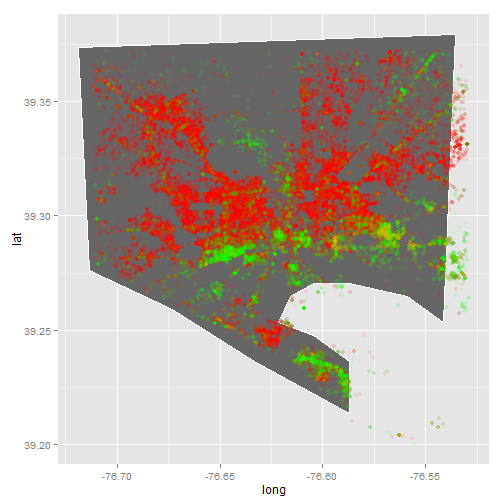
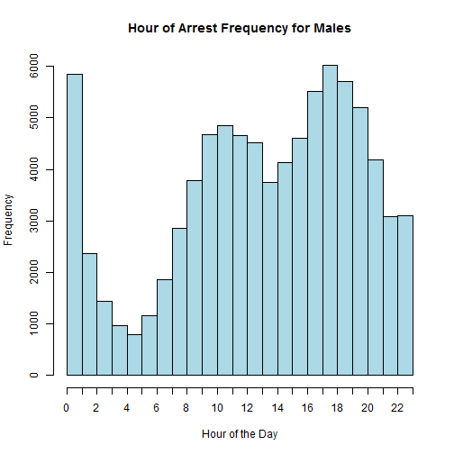
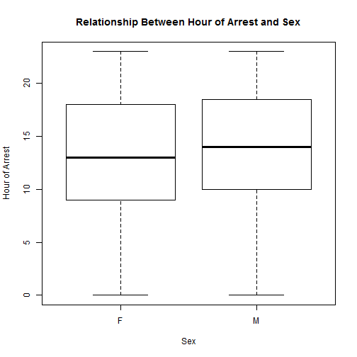
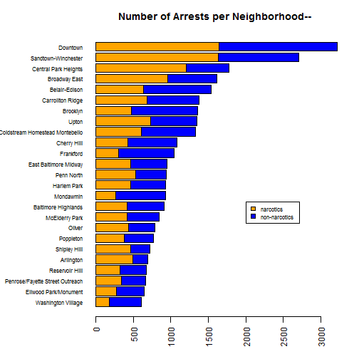
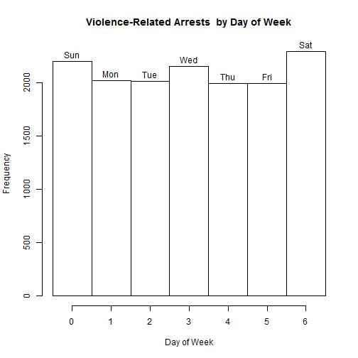
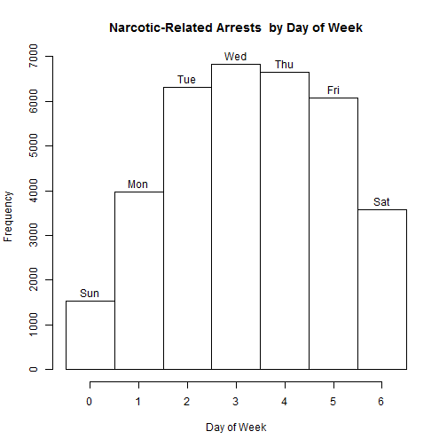
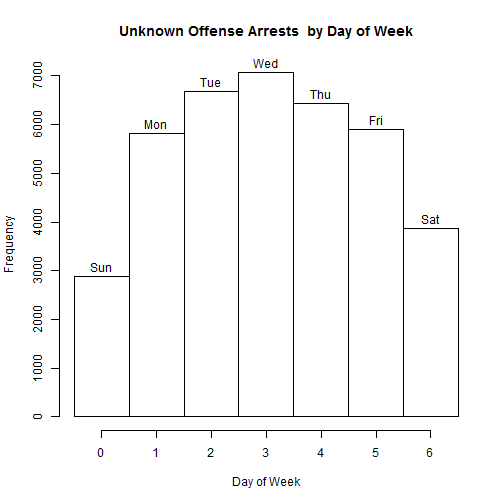
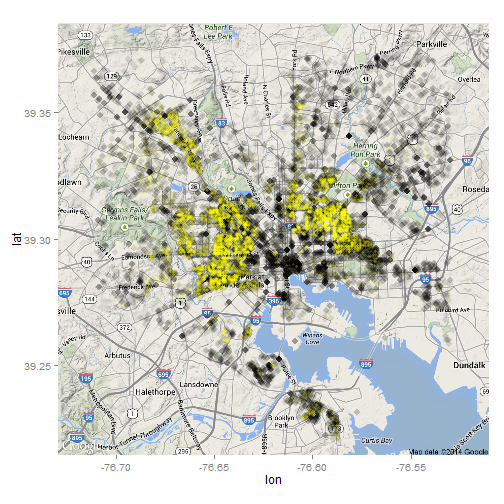
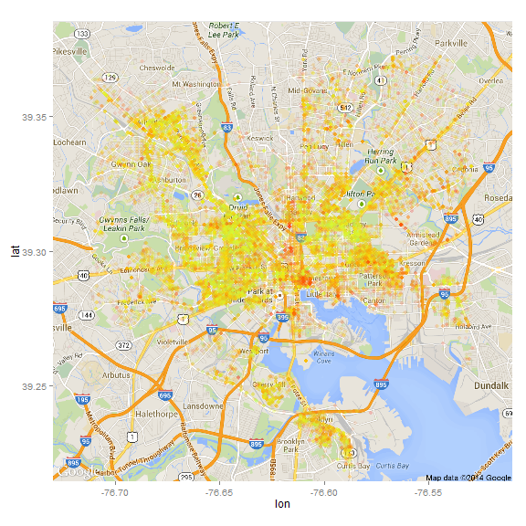

A quick analysis of Baltimore crime
========================================================

I'm going to do a very simple analysis of Baltimore crime to show off R. We'll use data downloaded from Baltimore City's awesome open data site. 

### Getting data

* Arrest data: https://data.baltimorecity.gov/Crime/BPD-Arrests/3i3v-ibrt 
* CCTV data: https://data.baltimorecity.gov/Crime/CCTV-Locations/hdyb-27ak 

Let's load the data:

```r
arrest_tab = read.csv("BPD_Arrests.csv", stringsAsFactors = FALSE)
cctv_tab = read.csv("CCTV_Locations.csv", stringsAsFactors = FALSE)

# these columns are mislabeled, so fix them
tmp = arrest_tab$sex
arrest_tab$sex = arrest_tab$race
arrest_tab$race = tmp
```


### Exploring data


```r
# dimension of table (data.frame)
dim(arrest_tab)
```

```
## [1] 104528     15
```

```r

# what are the columns
names(arrest_tab)
```

```
##  [1] "arrest"            "age"               "sex"              
##  [4] "race"              "arrestDate"        "arrestTime"       
##  [7] "arrestLocation"    "incidentOffense"   "incidentLocation" 
## [10] "charge"            "chargeDescription" "district"         
## [13] "post"              "neighborhood"      "Location.1"
```

```r

# what is the average arrest age?
mean(arrest_tab$age)
```

```
## [1] 33.2
```

```r

# the range of arrest ages
range(arrest_tab$age)
```

```
## [1]  0 87
```

```r

# how many arrests per sex
table(arrest_tab$sex)
```

```
## 
##           F     M 
##     2 19431 85095
```

```r

# what are the most common offenses
head(sort(table(arrest_tab$incidentOffense), decreasing = TRUE))
```

```
## 
##         Unknown Offense            87-Narcotics       4E-Common Assault 
##                   38649                   24744                    6739 
## 87O-Narcotics (Outside)     97-Search & Seizure                79-Other 
##                    6515                    3670                    3461
```

```r

# range of arrests after removing those w/ age==0
range(arrest_tab$age[arrest_tab$age > 0])
```

```
## [1]  8 87
```


Let's see a table of arrests by sex and race

```r
table(sex = arrest_tab$sex, race = arrest_tab$race)
```

```
##    race
## sex           A     B     H     I     U     W
##         2     0     0     0     0     0     0
##   F     0    37 14663     0    34   183  4514
##   M     0   205 72605     1   184  1566 10534
```


A histogram of age


```r
hist(arrest_tab$age, nc = 100)
```

 

```r
with(arrest_tab, hist(age[sex == "M"], nc = 100))  # males only
```

 

```r
with(arrest_tab, hist(age[sex == "F"], nc = 100))  # females only
```

 


### Are males and females arrested at different ages on average?

Let's take a look at how age depends on sex. Let's plot age as a function of sex first (notice how we indicate that sex is a `factor`). 


```r
plot(arrest_tab$age ~ factor(arrest_tab$sex))
```

 


One of the neat things about R is that statistical model building and testing is built-in. The model we use is $y_i=\beta_0+\beta_1 x_i$ where $y_i$ is age of sample (example) $i$ and $x_i$ is an indicator variable $x_i \in \{0,1\}$ with $x_i=1$ if the $i$-th record (example) is male. You can check that $\beta_1$ is the difference in mean age between females and males.
We use the formula syntax to build a linear regression model. 


```r
# let's ignore those records with missing sex
fit = lm(age ~ factor(sex), data = arrest_tab, subset = arrest_tab$sex %in% 
    c("M", "F"))
summary(fit)
```

```
## 
## Call:
## lm(formula = age ~ factor(sex), data = arrest_tab, subset = arrest_tab$sex %in% 
##     c("M", "F"))
## 
## Residuals:
##    Min     1Q Median     3Q    Max 
## -33.39 -10.15  -3.15   9.61  53.85 
## 
## Coefficients:
##              Estimate Std. Error t value Pr(>|t|)    
## (Intercept)   33.3878     0.0847   394.1   <2e-16 ***
## factor(sex)M  -0.2343     0.0939    -2.5    0.013 *  
## ---
## Signif. codes:  0 '***' 0.001 '**' 0.01 '*' 0.05 '.' 0.1 ' ' 1
## 
## Residual standard error: 11.8 on 104524 degrees of freedom
## Multiple R-squared:  5.96e-05,	Adjusted R-squared:  5e-05 
## F-statistic: 6.23 on 1 and 104524 DF,  p-value: 0.0126
```


We see that $\beta_1 \approx -0.2$ meaning that the arrest age for males is about 2.5 months younger. So there is very little difference in the average age (which is what the linear model is testing) but we see that the probability of observing this difference from a sample of this size **when there is no difference in average age** is small $p \approx 0.01$. Since we have a very large number of examples, or records, this testing framework will declare very small differences as *statistically significant*. We'll return to this theme later in class.


### Geographic distribution of arrests.

First we need to extract latitude and longitude from location, we'll use some string functions to do this


```r
tmp = gsub("\\)", "", gsub("\\(", "", arrest_tab$Location))
tmp = strsplit(tmp, split = ",")
arrest_tab$lon = as.numeric(sapply(tmp, function(x) x[2]))
arrest_tab$lat = as.numeric(sapply(tmp, function(x) x[1]))
```


Now let's plot


```r
plot(arrest_tab$lon, arrest_tab$lat, xlab = "Longitude", ylab = "Latitude", 
    main = "Arrests in Baltimore")
```

 


We can also use density estimates to make this nicer:


```r
smoothScatter(arrest_tab$lat, arrest_tab$lon, xlab = "Latitude", ylab = "Longitude", 
    main = "Arrests in Baltimore")
```

```
## KernSmooth 2.23 loaded
## Copyright M. P. Wand 1997-2009
```

 


Let's make this fancier using the `ggplot2` graphics systems and the `maps` package containing map data.


```r
library(maps)
```

```
## Warning: package 'maps' was built under R version 3.0.2
```

```r
library(ggplot2)
```

```
## Warning: package 'ggplot2' was built under R version 3.0.2
```

```r

balto_map = subset(map_data("county", region = "maryland"), subregion == "baltimore city")
plt = ggplot()
plt = plt + geom_polygon(data = balto_map, aes(x = long, y = lat), color = "white", 
    fill = "gray40")
plt = plt + geom_point(data = arrest_tab, aes(x = lon, y = lat), color = "blue", 
    alpha = 0.1)
print(plt)
```

```
## Warning: Removed 40636 rows containing missing values (geom_point).
```

 


Now let's add CCTV cameras.


```r
tmp = gsub("\\)", "", gsub("\\(", "", cctv_tab$Location))
tmp = strsplit(tmp, split = ",")
cctv_tab$lon = as.numeric(sapply(tmp, function(x) x[2]))
cctv_tab$lat = as.numeric(sapply(tmp, function(x) x[1]))

plt = ggplot()
plt = plt + geom_polygon(data = balto_map, aes(x = long, y = lat), color = "white", 
    fill = "gray40")
plt = plt + geom_point(data = arrest_tab, aes(x = lon, y = lat), color = "blue", 
    alpha = 0.1)
plt = plt + geom_point(data = cctv_tab, aes(x = lon, y = lat), color = "red")
print(plt)
```

```
## Warning: Removed 40636 rows containing missing values (geom_point).
```

 


### A challenge

Is there any relationship between the number of CCTV cameras and the number of arrests? Divide the city into a grid and plot the number of CCTV cameras vs. the number of arrests.


```r
latRange = range(arrest_tab$lat, na.rm = TRUE)
lonRange = range(arrest_tab$lon, na.rm = TRUE)
latGrid = seq(min(latRange), max(latRange), len = 50)
lonGrid = seq(min(lonRange), max(lonRange), len = 50)
latFac = as.numeric(cut(arrest_tab$lat, breaks = latGrid))
lonFac = as.numeric(cut(arrest_tab$lon, breaks = lonGrid))

gridFac = (latFac - 1) * length(latGrid) + (lonFac - 1)

latFac = as.numeric(cut(cctv_tab$lat, breaks = latGrid))
lonFac = as.numeric(cut(cctv_tab$lon, breaks = lonGrid))
cctvGridFac = (latFac - 1) * length(latGrid) + (lonFac - 1)

arrestTab = table(gridFac)
cctvTab = table(cctvGridFac)
m = match(names(cctvTab), names(arrestTab))
plot(arrestTab[m] ~ factor(cctvTab))
```

 


### Extra analyses

As part of HW1 you will add to this analysis. Please use the following template:

#### Your name(s) here
Eric Krokos

What question are you asking?:
What does the distribution of arrests look like for Asians(Blue), Blacks(Red), Whites(Green), and Unknown (Orange)?

What is the code you use to answer it?:


```r
asian = arrest_tab[arrest_tab$race == "A", ]
black = arrest_tab[arrest_tab$race == "B", ]
white = arrest_tab[arrest_tab$race == "W", ]
unknown = arrest_tab[arrest_tab$race == "U", ]
library(maps)
library(ggplot2)
balto_map = subset(map_data("county", region = "maryland"), subregion == "baltimore city")
plt = ggplot()
plt = plt + geom_polygon(data = balto_map, aes(x = long, y = lat), color = "white", 
    fill = "gray40")
plt = plt + geom_point(data = asian, aes(x = lon, y = lat), color = "blue", 
    alpha = 0.1)
plt = plt + geom_point(data = black, aes(x = lon, y = lat), color = "red", alpha = 0.1)
plt = plt + geom_point(data = white, aes(x = lon, y = lat), color = "green", 
    alpha = 0.1)
plt = plt + geom_point(data = unknown, aes(x = lon, y = lat), color = "orange", 
    alpha = 0.1)
print(plt)
```

```
## Warning: Removed 93 rows containing missing values (geom_point).
## Warning: Removed 33454 rows containing missing values (geom_point).
## Warning: Removed 6251 rows containing missing values (geom_point).
## Warning: Removed 749 rows containing missing values (geom_point).
```

 


What did you observe?
=======
The red (Black) dominate the map, but it's interesting that most crimes commited by Whites are done on the southern most part of the city, with Black crime occuring primarily in the upper part. It's difficult to see Asian commited crime. Given that most of the orange dots are in the southern part of the city, I would guess that most of the unknown races are from White people.

#### Andy Garron, Mohit Iyyer, Peter Enns, Fan Du

What question are you asking?: In which months do arrests occur the most? On what day of the week do arrests occur the most?

What is the code you use to answer it?:


```r
arrestDates = as.Date(arrest_tab$arrestDate, "%m/%d/%Y")
dwka <- format(arrestDates, "%a")
# dwka
dwkn <- as.numeric(format(arrestDates, "%w"))  # numeric version
hist(dwkn, main = "Arrests by Day of Week", xlab = "Day of Week", ylab = "Arrest Frequency", 
    breaks = -0.5 + 0:7, labels = unique(dwka[order(dwkn)]))
```

 

```r

dwkm <- format(arrestDates, "%b")  # get month labels
dwkmn <- as.numeric(format(arrestDates, "%m"))  # get numeric data for histogram
hist(dwkmn, main = "Arrests by Month", xlab = "Month of Year", ylab = "Arrest Frequency", 
    breaks = 0:12, labels = unique(dwkm[order(dwkmn)]))
```

 


At the month level, we observe that there is a decline in arrest rates during the winter months and that arrests peak in March and August.

At the day level, we observe that most arrests occur in the middle of the week and that significantly fewer arrests occur on the weekends.

#### Patricia Sazama

Is there a relationship between the age of the arrested individual and the time they are arrested?


```r
# change the time format from hh:mm to hh.mm so it can be converted to a
# numeric value
tmp = gsub(":", ".", arrest_tab$arrestTime)

# convert the arrestTime to numeric
arrestTime = as.numeric(tmp)

# group ages into 5 buckets
ages = arrest_tab$age
ages = cut(ages, 5)

# plot the age buckets as a factor of the numeric arrest times
plot(arrestTime ~ factor(ages))
```

 

From these plots we can see slight differences in the average times of day members of these age groups are arrested.  We can observe that as age increases, generally the time of arrest is earlier in the day though this is only a very slight difference.  For all groups the average time of arrest is very close to 15:00.


#### Steven Burgart

What question are you asking?: Is there a relationship between the time a person is arrested and their sex?

What is the code you use to answer it?:


```r

# Make a copy of arrest_tab since we need to modify
arrest_tab_skb <- arrest_tab

# Filter out arrests with unknown sex
arrest_tab_skb <- arrest_tab_skb[arrest_tab_skb$sex == "M" | arrest_tab_skb$sex == 
    "F", ]

# Convert time to just hours as numeric
arrest_tab_skb["arrestTime"] <- lapply(arrest_tab_skb["arrestTime"], function(x) as.numeric(strftime(strptime(x, 
    format = "%H:%M"), "%H")))

# Plot male arrests by hour
hist(arrest_tab_skb[arrest_tab_skb$sex == "M", ]$arrestTime, breaks = 24, main = "Hour of Arrest Frequency for Males", 
    xlab = "Hour of the Day", col = "lightblue", xlim = range(0:23), xaxt = "n")
axis(side = 1, at = seq(0, 23), labels = seq(0, 23))
```

 

```r

# Plot female arrests by hour
hist(arrest_tab_skb[arrest_tab_skb$sex == "F", ]$arrestTime, breaks = 24, main = "Hour of Arrest Frequency for Females", 
    xlab = "Hour of the Day", col = "pink", xlim = range(0:23), xaxt = "n")
axis(side = 1, at = seq(0, 23), labels = seq(0, 23))
```

 

```r

# Plot relationship between hour of arrest and sex
plot(arrest_tab_skb$arrestTime ~ factor(arrest_tab_skb$sex), main = "Relationship Between Hour of Arrest and Sex", 
    xlab = "Sex", ylab = "Hour of Arrest")
```

 


What did you observe?: From the two histograms it isn't readily apparent that there is any relationship between the time a person is arrested and their sex. However, from the third plot we can see that males tend to be arrested slightly later in the day when compared to females.


#### Rob Argue

What question are you asking?:

Do violent crimes occur more in certain areas?


What is the code you use to answer it?:


```r

# The FBI classifies the following as violent crime: - murder and
# nonnegligent manslaughter - forcible rape - robbery - aggravated assault
# as per
# http://www.fbi.gov/about-us/cjis/ucr/crime-in-the-u.s/2011/crime-in-the-u.s.-2011/violent-crime/violent-crime

violent = c("1A-Murder", "2A-Rape (Force)", "2B-Rape (Attempt)", "3AF-Robb Hwy-Firearm", 
    "3AJF-Robb Carjack-Firearm", "3AJK-Robb Carjack-Knife", "3AK-Robb Hwy-Knife", 
    "3AO-Robb Hwy-Other Wpn", "3CF-Robb Comm-Firearm", "3CK-Robb Comm-Knife", 
    "3CO-Robb Comm-Other Wpn", "3EF-Robb Gas Station-Firearm", "3EK-Robb Gas Station-Knife", 
    "3GF-Robb Conv Store-Firearm", "3GK-Robb Conv Store-Knife", "3GO-Robb Conv Store-Other Wpn", 
    "3JF-Robb Residence-Firearm", "3JK-Robb Residence-Knife", "3JO-Robb Residence-Other Wpn", 
    "3LF-Robb Bank-Firearm", "3FO-RObb Bank-Other Wpn", "3NF-Robb Misc-Firearm", 
    "3NK-Robb Misc-Knife", "3NO-Robb Misc-Other Wpn", "4A-Agg. Asslt.- Gun", 
    "4B-Agg. Asslt.- Cut", "4C-Agg. Asslt.- Oth.", "4D-Agg. Asslt.- Hand")

plt = ggplot()
plt = plt + geom_polygon(data = balto_map, aes(x = long, y = lat), color = "white", 
    fill = "gray40")
plt = plt + geom_point(data = arrest_tab, aes(x = lon, y = lat), color = "blue", 
    alpha = 0.1)
plt = plt + geom_point(data = arrest_tab[arrest_tab$incidentOffense %in% violent, 
    ], aes(x = lon, y = lat), color = "red", alpha = 0.2)
print(plt)
```

```
## Warning: Removed 40636 rows containing missing values (geom_point).
## Warning: Removed 997 rows containing missing values (geom_point).
```

 


What did you observe?

It appears that there is a heavier concentration of violent crimes in the inner city, particularly in a few hotspots (of which I am unaware the significance of). There also appear to be a couple of specific outlying locations where an unusually large number of violent crimes occur.
#### Hao Zhou(zhhoper), Fang Cheng(Javran)

* What question are you asking?

    Is there any difference between minors and adults
    in terms of time and location?
    (we suppose people under 21 are minors)

* What is the code you use to answer it?
    
    We split data into two parts
    (i.e.  minors (age < 21) and adults (age >= 21)),
    plot the distribution of arrest time 
    and draw scatters according to the location
    for both minors and adults.


```r

# copy data frame, filter out invalid data (age = 0)
arrestTmp <- subset(arrest_tab, arrest_tab$age != 0)

# extract geo info
tmp <- gsub("\\).*", "", gsub(".*\\(", "", arrestTmp$Location))
tmp = strsplit(tmp, split = ",")
arrestTmp$lat <- as.numeric(sapply(tmp, function(x) x[2]))
arrestTmp$lon <- as.numeric(sapply(tmp, function(x) x[1]))

# suppress warnings
arrestTmp <- subset(arrestTmp, !is.na(lon) & !is.na(lat))

# tag data with 'minors' and 'adults' according to their ages
arrestTmp$biAge <- sapply(arrestTmp$age, function(x) {
    if (x < 21) {
        return("minors")
    } else {
        return("adults")
    }
})

# new col: time -> time in Hour
arrestTmp$arrestTimeH <- as.integer(gsub(":[0-9][0-9]", "", arrestTmp$arrestTime))

# plot minors' distribution
minors_tab <- subset(arrestTmp, arrestTmp$biAge == "minors")
minorsArray <- minors_tab$arrestTimeH
minorsTable <- as.integer(table(factor(minorsArray)))
barplot(minorsTable, space = 0, width = 1, xlab = "Time", ylab = "Number of arrset", 
    main = "Number of arrest in each hour (minors)", axes = T)
axis(side = 1, at = seq(0, 23), labels = seq(0, 23))
```

 

```r

# plot adults' distribution
adults_tab <- subset(arrestTmp, arrestTmp$biAge == "adults")
adultsArray <- adults_tab$arrestTimeH
adultsTable <- as.integer(table(factor((adultsArray))))
barplot(adultsTable, space = 0, width = 1, xlab = "Time", ylab = "Number of arrset", 
    main = "Number of arrest in each hour (adults)", axes = T)
axis(side = 1, at = seq(0, 23), labels = seq(0, 23))
```

 

```r

plot(arrestTmp$arrestTimeH ~ factor(arrestTmp$biAge), main = "Relationship Between time of Arrest and minor or not", 
    xlab = "age", ylab = "Hour of Arrest")
```

 

```r

# visualize arrest location for minors & adults
smoothScatter(minors_tab$lat, minors_tab$lon, xlab = "Latitude", ylab = "Longitude", 
    main = "Arrests in Baltimore (minors)")
```

 

```r
smoothScatter(adults_tab$lat, adults_tab$lon, xlab = "Latitude", ylab = "Longitude", 
    main = "Arrests in Baltimore (adults)")
```

 

```r

# cleanup
rm(arrestTmp, tmp)
rm(adults_tab, adultsTable, adultsArray)
rm(minors_tab, minorsTable, minorsArray)

```


* What did you observe?

    * Through the first two figures, we observe that
    minors tend to commit less during 1 - 6 a.m., but more during 2 - 8 p.m.

    * There is little difference between the time distribution of minors and adults.

    * From the last two scatters we can tell that the density is slightly different in the northwest part.
    More interesting conclusions could be drawn if we can compare this result with the local map.

#### Hui Miao

What question are you asking?: What is the most common incident offense, and how does it related to sex, race and district?

What is the code you use to answer it?:


```r
old_par <- par(no.readonly = TRUE)

# first let's look at the bar plot of the distribution of incident offense
# types as there are many # of inccident offsense types, I use a filter to
# get rid of 'unknown offense' that we don't care about, and the ones with
# less than 200 cases in order to make the plot clear to understand
library(sqldf)
```

```
## Error: there is no package called 'sqldf'
```

```r
a = sqldf("select incidentOffense, count(*) as cnt from arrest_tab where incidentOffense != 'Unknown Offense' group by incidentOffense having cnt >= 200 order by cnt")
```

```
## Error: could not find function "sqldf"
```

```r
par(las = 2, mar = c(5, 7, 4, 2))
barplot(a$cnt, horiz = TRUE, cex.names = 0.7, names.arg = a$incidentOffense)
```

```
## Error: object 'a' not found
```

```r

# as you can see, the most common incident offense is 'Narcotics' (the 1st
# and 3rd row) next, let's analyze the correlations between 'Narcotics'
# inccident type and sex, race and district this is a correlation analysis
# invovling in multiple categorical variables I use a mosaic plot instead of
# the correlogram plot to show their correlations in one plot

library(vcd)
```

```
## Warning: package 'vcd' was built under R version 3.0.2
```

```
## Loading required package: grid
```

```r
filtered <- subset(arrest_tab, (race == "B" | race == "W") & sex != "" & district != 
    "" & (incidentOffense == "87-Narcotics" | incidentOffense == "87O-Narcotics (Outside)"))
filtered$district <- gsub("NORTHERN", "N", gsub("NORTHEASTERN", "NE", gsub("NORTHWESTERN", 
    "NW", filtered$district)))
filtered$district <- gsub("SOUTHERN", "S", gsub("SOUTHEASTERN", "SE", gsub("SOUTHWESTERN", 
    "SW", filtered$district)))
filtered$district <- gsub("WESTERN", "W", gsub("EASTERN", "E", gsub("CENTRAL", 
    "C", filtered$district)))
mosaic(~district + sex + race + incidentOffense, data = filtered, shade = TRUE, 
    legend = TRUE)
```

 

```r
par(old_par)
```


What did you observe?: The first bar plot shows that the 'Narcotics' is the most common inccident offense in this city. Interestingly 'Narcotics (Outside)' is another top3 inccident offense type.  

In the second plot, I use mosaic plot to visualize the correlations among multiple categorical variables (race (b, w), sex (m, f), district (w, sw, se, s, nw, ne, n, e, c)). Rectangle sizes reflect the frequentices of a group, the colors shows the pearson residuals (blue means above expected value, while red means it's below expected value of fitted model).

Here're some interesting findings:

1. From previous map plots with race info, we know that in the southern regions, white cases and black cases are similar. It is the same case for Narcotics. The south regions (SE, S), the numbers are similar (we can see from the heighs of the rectangle). In other regions, black dominants white. 

2. Where you can find narcotics cases? And where does outside Narcotics case happen more often than indoor? North (N), Southerne East (SE) and South (S) regions have the fewest instances of Narcotics cases. In the north eastern (NE) and south western (SW) regions, the Narcotics outside cases are above expected value, while Eastern (E), Northwestern (NW) and Western (W) regions outside cases are below expected value. 

3. Female's narcotics active region is quite different from male. In the central district (C), both female black and white are above the expected values for both inside and outside narcotics cases, while male cases regardless races are below expected value.


#### Ben Klimkowski and Jon Fetter-Degges
What question are you asking?:

What neighborhoods have the highest number of arrests? Of narcotics arrests? What is the nature of the crime in the worst neighborhoods?

What is the code you use to answer it?:

```r
# We begin by counting the total number of arrest records per neighborhood,
# throwing out those where the neighborhood is empty.
total <- table(arrest_tab$neighborhood[arrest_tab$neighborhood != ""])
# Now we do it again, using only narcotics arrests.
narc.arrests <- arrest_tab$neighborhood[grep("narcotics", arrest_tab$incidentOffense, 
    ignore.case = TRUE)]
narc <- table(narc.arrests[narc.arrests != ""])
# We want to put these vectors into the same data frame, so let's throw away
# neighborhoods with no narcotics arrests.
total <- total[names(total) %in% names(narc)]
df <- data.frame(total)
df$narc <- narc
# Now we can sort the frame by total number of arrests.
df <- df[order(df$total, df$narc), ]
df$nonnarc <- df$total - df$narc
# We'll get rid of extra variables; everything we need is in the frame.
rm(total, narc, narc.arrests)
# And generate a plot of neighborhoods with the most arrests, along with how
# many of them are for narcotics.  We looked at Hui Miao's code to find out
# how to save and restore graph parameters.
old_par <- par(no.readonly = TRUE)
par(las = 2, mar = c(4, 9, 3, 2) + 0.1)
barplot(t(as.matrix(df[df$total > 600, 2:3])), horiz = TRUE, col = c("orange", 
    "blue"), cex.names = 0.7, main = "Number of Arrests per Neighborhood--")
legend(2000, 12, legend = c("narcotics", "non-narcotics"), fill = c("orange", 
    "blue"), cex = 0.7)
```

 

```r
par(old_par)

# Using the code above it, we will now create graphics for the 5
# neighborhoods with the most crime: Downtown, Sandtown-Winchester, Central
# Park Heights, Broadway East, Belair-Edison

library(plotrix)
```

```
## Error: there is no package called 'plotrix'
```

```r
bmoreHoodAnalyze <- function(arg1) {
    # This function cleans the Baltimore dataset by combining similar crimes and
    # and graphically depicts the most frequently crimes in an area
    a <- table(arrest_tab$incidentOffense[arrest_tab$neighborhood == arg1])
    df <- data.frame(a)
    
    # Combine sums Narcotics
    narcoSum <- sum(df$Freq[df$Var1 == "87O-Narcotics (Outside)" | df$Var1 == 
        "87-Narcotics"])
    df$Freq[df$Var1 == "87-Narcotics"] <- narcoSum
    df <- df[!df$Var1 == "87O-Narcotics (Outside)", ]
    ## Unlabeled crimes
    unkSum <- sum(df$Freq[df$Var1 == "Unknown Offense" | df$Var1 == "79-Other"])
    df$Freq[df$Var1 == "Unknown Offense"] <- unkSum
    df <- df[!df$Var1 == "79-Other", ]
    df <- df[!df$Var1 == "Unknown Offense", ]
    
    # Concatenate the remainder of the crimes
    df <- df[order(-df$Freq), ]
    l <- as.vector(df[, 1])[0:5]
    freq <- as.vector(df[, 2])[0:5]
    freq <- c(freq, sum(as.vector(df[, 2])[6:dim(df)[1]]) + unkSum)
    l <- c(l, "Other")
    title <- paste0("Distribution of Type of Crime in ", arg1)
    pie3D(freq, labels = l, explode = 0.2, theta = pi/2.5, labelcex = 0.7, main = title)
}


bmoreHoodAnalyze("Downtown")
```

```
## Error: could not find function "pie3D"
```

```r
bmoreHoodAnalyze("Sandtown-Winchester")
```

```
## Error: could not find function "pie3D"
```

```r
bmoreHoodAnalyze("Central Park Heights")
```

```
## Error: could not find function "pie3D"
```

```r
bmoreHoodAnalyze("Broadway East")
```

```
## Error: could not find function "pie3D"
```

```r
bmoreHoodAnalyze("Belair-Edison")
```

```
## Error: could not find function "pie3D"
```

```r

```

What did you observe?:

It is clear from this analysis that narcotics related crimes are the most frequent ones across many neighborhoods in Baltimore.

Unfortunately, the Baltimore database left many entries as "79-Other" or unknown, so specific crimes are hard to correlate.  However, with some cleaning of the data-set, a clear pattern emerged in these problem spots.  After narcotics, the most frequent crime to be encountered would be assault or search/seizure related, followed by towed vehicles.


---
#### Perceptrons: Victoria Cepeda, Ahmed Kosba, Mat?as Marenchino, Mohamed Gunady

What question are you asking?:

    1. As presented earlier by another team, arrests rate on the weekend is not as high as in the middle of the week, although it was expected for crimes to be a bit more in the weekend. So Why is that?

    2. How is the number of vacant houses correlated with the crime rate in a neighborhood? We are concerned with two types of crimes: 1) Violence-related. 2) Narcotic-related. We obtained a dataset for vacant buildings in Baltimore and used it to plot their locations vs. the geographical distribution of each crime category.

What is the code you use to answer it?:

    Test1: Crimes on the weekend.

```r

# Define two types of crimes: Violence-Related, Narcotic-Related
narcotics <- c("87-Narcotics", "87O-Narcotics (Outside)", "97-Search & Seizure")
violentCrimes <- c("102-Questional Death", "104-Malicious Burning", "105-Suspicious Burning", 
    "115-Trespassing", "1A-Murder", "2A-Rape (Force)", "2B-Rape (Attempt)", 
    "2D-Statutory Rape", "2G-Sodomy/Perverson", "2J-Other Sex Offn.", "39-Fire", 
    "3AF-Robb Hwy-Firearm", "3AJF-Robb Carjack-Firearm", "3AJK-Robb Carjack-Knife", 
    "3AK-Robb Hwy-Knife", "3AO-Robb Hwy-Other Wpn", "3B-Robb Highway (Ua)", 
    "3BJ-Robb Carjack(Ua)", "3CF-Robb Comm-Firearm", "3CK-Robb Comm-Knife", 
    "3CO-Robb Comm-Other Wpn", "3D-Robb Comm. (Ua)", "3EF-Robb Gas Station-Firearm", 
    "3EK-Robb Gas Station-Knife", "3F-Robb Gas Sta. (Ua)", "3GF-Robb Conv Store-Firearm", 
    "3GK-Robb Conv Store-Knife", "3GO-Robb Conv Store-Other Wpn", "3H-Robb Conv. Stor.(Ua)", 
    "3JF-Robb Residence-Firearm", "3JK-Robb Residence-Knife", "3JO-Robb Residence-Other Wpn", 
    "3K-Robb Res. (Ua)", "3LF-Robb Bank-Firearm", "3FO-RObb Bank-Other Wpn", 
    "3M-Robb Bank (Ua)", "3NF-Robb Misc-Firearm", "3NK-Robb Misc-Knife", "3NO-Robb Misc-Other Wpn", 
    "3P-Robb Misc. (Ua)", "49-Family Disturbance", "4A-Agg. Asslt.- Gun", "4B-Agg. Asslt.- Cut", 
    "4C-Agg. Asslt.- Oth.", "4D-Agg. Asslt.- Hand", "4E-Common Assault", "4F-Assault By Threat", 
    "52A-Animal Cruelty", "56-Missing Person", "75-Destruct. Of Property", "76-Child Abuse-Sexual", 
    "7A-Stolen Auto")

# Arrest data for the two types of crimes, and crimes with unknown offense
violent_arrests <- arrest_tab[arrest_tab$incidentOffense %in% violentCrimes, 
    ]
narcotic_arrests <- arrest_tab[arrest_tab$incidentOffense %in% narcotics, ]
unknown_arrests <- arrest_tab[arrest_tab$incidentOffense == "Unknown Offense", 
    ]

# Histogram function for crimes over the days of week
hist_dayofweek <- function(dataDates, dataName) {
    dates = as.Date(dataDates, "%m/%d/%Y")
    dayofweek <- format(dates, "%a")
    dayofweek_nums <- as.numeric(format(dates, "%w"))  # numeric version
    hist(dayofweek_nums, main = paste(dataName, " by Day of Week"), xlab = "Day of Week", 
        ylab = "Frequency", breaks = -0.5 + 0:7, labels = unique(dayofweek[order(dayofweek_nums)]))
}

# Plot histogram of violence-related arrests over the week
hist_dayofweek(violent_arrests$arrestDate, "Violence-Related Arrests")
```

 

```r
# Plot histogram of narcotic-related arrests over the week
hist_dayofweek(narcotic_arrests$arrestDate, "Narcotic-Related Arrests")
```

 

```r
# Plot histogram of unknown-offense arrests over the week
hist_dayofweek(unknown_arrests$arrestDate, "Unknown Offense Arrests")
```

 


    Test2: Vacant buildings vs. Crime areas.

```r

# Prepare the dataset of vacant buildings
vacant_tab <- read.csv("Vacant_Buildings.csv", stringsAsFactors = FALSE)

# prepare long/lat comlumns
tmp = gsub("\\)", "", gsub("\\(", "", vacant_tab$Location))
tmp = strsplit(tmp, split = ",")
vacant_tab$lon = as.numeric(sapply(tmp, function(x) x[2]))
vacant_tab$lat = as.numeric(sapply(tmp, function(x) x[1]))

# Plot the geographical distribution of vacant buildings vs. arrests
library(ggplot2)
library(ggmap)
```

```
## Warning: package 'ggmap' was built under R version 3.0.2
```

```r

# Function to plot datapoints using GoogleMaps API
plot_map <- function(map, dataPoints, dataPoints2) {
    googleMap = ggmap(map)
    googleMap = googleMap + geom_point(data = dataPoints, aes(x = lon, y = lat), 
        color = "black", alpha = 0.1, size = 3)
    if (!missing(dataPoints2)) {
        googleMap = googleMap + geom_point(data = dataPoints2, aes(x = lon, 
            y = lat), color = "yellow", alpha = 0.1, size = 1.5)
    }
    googleMap
}

# Get Baltimore city map from GoogleMaps
map = get_map(location = c(lon = -76.62, lat = 39.3), zoom = 12, maptype = "terrain")
```

```
## Map from URL : http://maps.googleapis.com/maps/api/staticmap?center=39.3,-76.62&zoom=12&size=%20640x640&scale=%202&maptype=terrain&sensor=false
## Google Maps API Terms of Service : http://developers.google.com/maps/terms
```

```r

# Plot violence-related arrests vs. vacant buildings locations
plot_map(map, violent_arrests, vacant_tab)
```

```
## Warning: Removed 2588 rows containing missing values (geom_point).
```

 

```r
# Plot narcotic-related arrests vs. vacant buildings locations
plot_map(map, narcotic_arrests, vacant_tab)
```

```
## Warning: Removed 2744 rows containing missing values (geom_point).
```

 


What did you observe?:

    1. For Q1: 
      - As observed from the figures, violence-related arrests are high in weekends (with a peak on Saturday) as anticipated.
      - Both narcotic-related arrests and arrests with unknown-offense have their peak in the middle of the week, with a lower rate on weekends.
      - As the number of records for narcotic-related and unknown offense arrests are much higher than violence-related arrests, the overall total crime rate has its peak on Wednesday, not in weekends.

    2. For Q2:
      As predicted, the figures show that the vacant buildings in a neighborhood are correlated with its crime rate, with a bit more correlation with neighborhoods where arrests due to violence occurred than the narcotic-related arrests.
---

#### Xiyang Dai

What question are you asking?:

  Q1. Is there a relationship between arrest time and crime type? 
  
  Q2. Is there a relationship between arrest time and arrest location (longitude, latitude)?

What is the code you use to answer it?:


```r
library(ggmap)
library(ggplot2)

# Define function that converts time to numerical value for calculation
time2num = function(x) {
    tmp = as.numeric(gsub("\\:", "", x))
    x = tmp/100 + tmp%%100/60
}

# Get subtable from the original table
arrest_tab_tmp1 = subset(arrest_tab, incidentOffense != "", select = c(arrestTime, 
    incidentOffense))
arrest_tab_tmp1 = arrest_tab_tmp1[complete.cases(arrest_tab_tmp1), ]
arrest_tab_tmp1$arrestTime = sapply(arrest_tab_tmp1$arrestTime, time2num)

# Plot the the relationship between arrest time and crime type, reorder them
# based on the median of arrest time value
arrest_tab_tmp1$incidentOffense = with(arrest_tab_tmp1, reorder(incidentOffense, 
    arrestTime, median))
qplot(factor(arrest_tab_tmp1$incidentOffense), arrest_tab_tmp1$arrestTime, main = "Relationship Between Arrest Time and Crime Type", 
    xlab = "Crime Type", ylab = "Arrest Time", geom = "boxplot", asp = 2) + 
    coord_flip()
```

 


```r
# Get subtable from the original table
arrest_tab_tmp2 = subset(arrest_tab, select = c(arrestTime, lon, lat))
arrest_tab_tmp2 = arrest_tab_tmp2[complete.cases(arrest_tab_tmp2), ]
arrest_tab_tmp2$arrestTime = sapply(arrest_tab_tmp2$arrestTime, time2num)

# Cut number into bins for color visualization
rgb_pal = colorRampPalette(c("blue", "green", "red"), bias = 1)
a_color = rgb_pal(12)[as.numeric(cut(arrest_tab_tmp2$arrestTime, breaks = 12))]

# Get Baltemore map from Google Map
map = get_map(location = c(lon = -76.62, lat = 39.3), zoom = 12, maptype = "roadmap")
```

```
## Map from URL : http://maps.googleapis.com/maps/api/staticmap?center=39.3,-76.62&zoom=12&size=%20640x640&scale=%202&maptype=roadmap&sensor=false
## Google Maps API Terms of Service : http://developers.google.com/maps/terms
```

```r
plt = ggmap(map)

# Visualize arrest time on map
plt = plt + geom_point(data = arrest_tab_tmp2, aes(x = arrest_tab_tmp2$lon, 
    y = arrest_tab_tmp2$lat), color = a_color, alpha = 0.2)
plt = plt + guides(title = "Arrest Time", fill = guide_colorbar())
print(plt)
```

```
## Warning: Removed 61 rows containing missing values (geom_point).
```

 


What did you observe?

  Q1: As expected, there is a obvious relationship between arrest time and crime type. From the figure, we can conclude the tendency for specific crime. For example, rob stores or gas stations usually happen in the late night. However, Rob banks usually happen in the afternoon.

  Q2: It seems that there is a relationship between arrest time and arrest location. In places near the downtown, crimes trend to happen in night. In places far from downtown, crimes trend to happen in daytime. But this relationship still needs to be further analyzed commbing with specific geographic features.  
  
---

#### Ruofei Du
What question are you asking?:

Is there a relationship between top crime types and age of the criminals? For instance, the younger criminals tend to commit more aggressive offence while the older tend to commit more stealthy offence.

What is the code you use to answer it?:

```r
# Remove the data with unknown offense or other type
arrestData <- subset(arrest_tab, age > 0 & incidentOffense != "Unknown Offense" & 
    incidentOffense != "79-Other")
arrestData <- subset(arrestData, select = c(age, incidentOffense))

# Calculate the frequency of each crime type
offenseFreq <- table(arrestData$incidentOffense)
offenseFreq <- sort(offenseFreq, decreasing = TRUE)
N <- 15
topN <- data.frame(IncidentOffense = names(offenseFreq[1:N]), Freq = as.integer(offenseFreq[1:N]))
arrestData$topIncident <- sapply(arrestData$incidentOffense, function(x) {
    id <- 0
    for (y in names(offenseFreq[1:N])) {
        id <- id + 1
        if (x == y) {
            return(id)
        }
    }
    return(-1)
})
arrestData <- subset(arrestData, arrestData$topIncident != -1)
# Sort y axis by median of age; sort color by frequency
arrestData$incidentOffense = with(arrestData, reorder(incidentOffense, age, 
    median))
arrestData$topOffense = with(arrestData, reorder(incidentOffense, topIncident, 
    median))
Top_15_Offenses <- arrestData$topOffense
qplot(factor(arrestData$incidentOffense), arrestData$age, main = "Relationship Between Age and Crime Type", 
    xlab = "Crime Type", ylab = "Age", geom = "boxplot", asp = 2, col = Top_N_Offenses) + 
    coord_flip()
```

```
## Error: object 'Top_N_Offenses' not found
```


What did you observe?:

There's indeed a weak relationship between age and criminal type. The older criminals tend to commit crimes with less violence such as shop lifting and burglary. E.G. the median of shoplifting criminals is of age 40; the younger criminals ten to commit crimes with more violence and sabotage such as trespassing, disorder, destrction of property.

However, the age range of criminals can be adolescents to relatively old poeple. Few people commit destrction of property after the age of 60.
